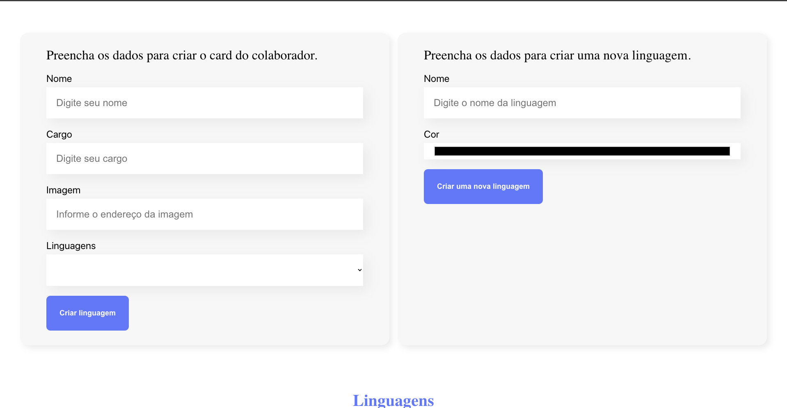
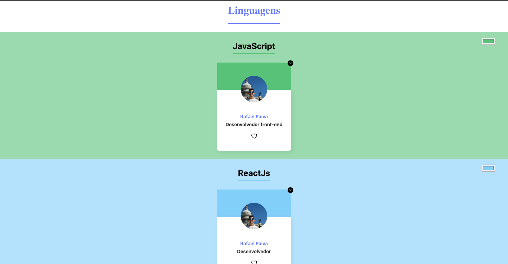

<h1 align="center">
 Site React
</h1>

  <a href="#-tecnologias">Tecnologias</a>&nbsp;&nbsp;&nbsp;|&nbsp;&nbsp;&nbsp;
  <a href="#-projeto">Projeto</a>&nbsp;&nbsp;&nbsp;|&nbsp;&nbsp;&nbsp;

 

  

 

  
  

## 🚀 Tecnologias

Esse projeto foi desenvolvido com as seguintes tecnologias:

- HTML
- CSS
- JavaScript
- ReactJs
- Git e GitHub

## 💻 Projeto

construí uma aplicação que permite cadastrar linguagens de programação como cards, com funcionalidades como:

✅ Adicionar e remover linguagens
✅ Favoritar linguagens
✅ Personalizar as cores dos cards das linguagens
✅ Lista com as linguagens adicionadas

Feito com ♥ by Rafael Paiva :wave:
